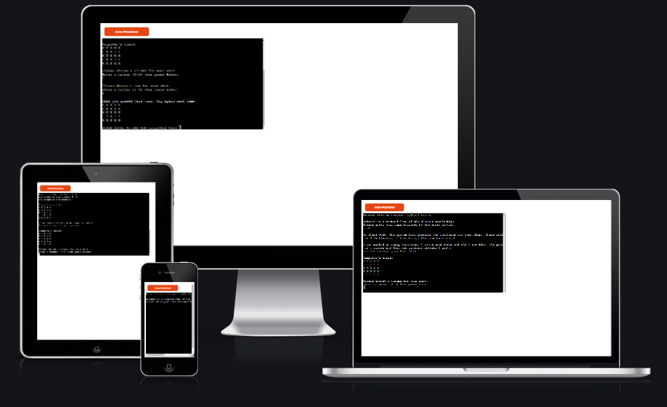
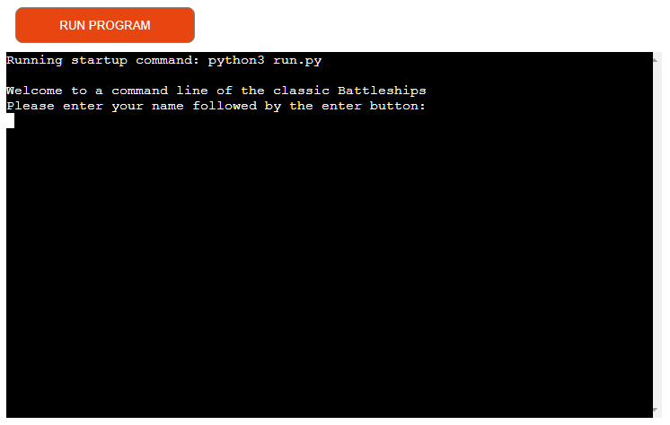
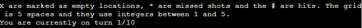
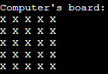
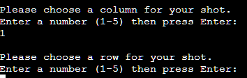
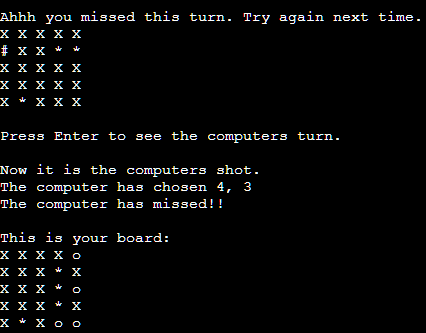

# Classic Battleships Command Line Game

Classic Battleships is a Python command line, terminal game. Able to be run in the Heroku deployment service.

A player will be able to play against a computer at the classic battleships game. Each player has ships hidden randomly with the computers shots also determined by random selection.

## Instructions on how to play.

This game is based on the classic game of Battleships. Find out more information [here.](https://en.wikipedia.org/wiki/Battleship_(game))

Our version however is a based example and does not include all the rules.

In this version the rules are as follows:
* Each player gets to take a shot. This must be between 1-5 for both the column and the row.
* Each players ships are placed randomly via the computer.
* The first player (user or computer) to either sink all of the others ships or hit the most ships at the end of 10 turns.

The boards of each player have a key:
* The X is a unguessed section.
* The o is the locations of the players ships.
* The # is a guess that has hit a ship.
* The * is a guess which has missed.

## Features

## Existing Features

* User input to start the game allows for a user to enter their name or username to be referred to.

* The initial welcome message with instructions and key for the boards. 

* The computers board is shown to the player for them to make a guess.

* After the computer shows the board it will request the user to input a number between 1-5 for column.

* The results for the players shot is shown on the board with a message informing. 

* Computer makes a random choice and then tells you both the choice and the results.

