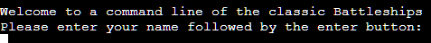

# Classic Battleships Command Line Game

Classic Battleships is a Python command line, terminal game. Able to be run in the Heroku deployment service.

A player will be able to play against a computer at the classic battleships game. Each player has ships hidden randomly with the computers shots also determined by random selection.

## Instructions on how to play.

This game is based on the classic game of Battleships. Find out more information [here.](https://en.wikipedia.org/wiki/Battleship_(game))

Our version however is a based example and does not include all the rules.

In this version the rules are as follows:
* Each player gets to take a shot. This must be between 1-5 for both the column and the row.
* Each players ships are placed randomly via the computer.
* The first player (user or computer) to either sink all of the others ships or hit the most ships at the end of 10 turns.

The boards of each player have a key:
* The X is a unguessed section.
* The o is the locations of the players ships.
* The # is a guess that has hit a ship.
* The * is a guess which has missed.

## Features

### Existing Features

* User input to start the game allows for a user to enter their name or username to be referred to.

* The initial welcome message with instructions and key for the boards. 

* The computers board is shown to the player for them to make a guess.

* After the computer shows the board it will request the user to input a number between 1-5 for column.

* The results for the players shot is shown on the board with a message informing. 

* Computer makes a random choice and then tells you both the choice and the results.

* At the end of the game. Either 10 rounds or first to destroy the others 4 ships, the game announces the winner or tie.

* Error checking
    * There is a guess validation step to ensure no guess is outside of the board.
    * The validator also checks if the guess has been used previously
    * This also ensures no other value other than required is used.

### Future Features

* Allow modification of board size.
* Allow different sized ships or difficulty level.
* Have the user the ability to modify the location of their ships.
* Potentially add a second player option rather than against computer.

## Testing

Manually testing this project by doing the following actions:

* Passsed the Python code through a PEP8 linter and confirmed there is no issues.
* Given invalid inputs: strings when numbers are expected, out of bounds and already chosen inputs.
Tested in my local terminal and the Heroku terminal.

### Bugs

#### Solved Bugs

* After initial testing, I noticed an error when selecting a Column and Row. This was due to order which calls the data when deciding placement on board.

* When first deploying to Heroku I also noticed the final result function was not initiating. This was fixed by ensuring the fuction is called only after the correct amouunt of games.

* When deploying on Heroku there was issues in connecting via GitHub application. This was fixed by connecting the repository via Heroku CLI.

#### Remaining Bugs

* No known bugs found with further testing.

### Validator Testing

* PEP8 - No errors were returned from PEP8online.com

## Deployment

This Battleship game was deployed using Code Institute's mock terminal for Heroku. Find my live site [here.](https://battleship-commandline.herokuapp.com/)

* Steps used for the deployment:
    * Login to Heroku and on account settings and 'reveal' your API key.
    * Run heroku login -i via the terminal on GitPod.
    * Login with email address and API as password.
    * Get app name by typing 'heroku apps' in the terminal.
    * Set the Heroku remote with 'heroku git:remote -a (app _name)
    * Then add, commit and push to GitHub and Heroku.

## Credits

* Code Institute for the deployment terminal.
* Wikipedia for the battleship game information.
* Python Docs for references to the needed functions and actions.
* Python online chatrooms with other programers discussing code. - 5 different sources with regards to the following sections: game_start()and generate_boards().